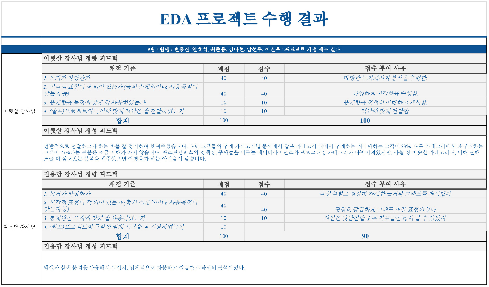

# 온라인 교육기업 결제 데이터 분석
9조: 김다현, 남선우, 변웅진, 안효석, 이진우, 최준용

> **프로젝트 설명**
> - **프로젝트 목표**: 2022년 온라인 강의 결제데이터를 분석 인사이트 도출
> - **데이터**: 결제 데이터 159,328개 (1인 중복결제, 프로모션 결제 포함)
> - **기간**: 23.05.09 ~ 23.05.16
> - **결과** 
> > 

 
> > 

---
> [!Abstract] 안녕하세요 9조입니다.
> 저희는 먼저 기존 데이터셋으로 분석할 수 있는 '주요 Factor'를 4가지 도출해 내어 그 4가지 Factor(요인)를 가지고 교육기업의 비즈니스 모델을 추론하고자 했습니다. 그리고 추론한 비즈니스모델을 가지고 특징과 강점 및 약점을 파악, 궁극적으로 매출에 어떻게 영향을 미치는지 살펴보았습니다. 그리고 살펴본 내용들에서 마케팅, 컨텐츠제작, 운영 등. 여러 관점으로 인사이트를 얻고자 했습니다.

# 0. EDA 수행계획

- **First Step.** 현재 데이터 셋으로 어떤 **‘factor’ 요인**을 분석할 수 있는지 확인!!
    
    - Factor : **고객**
        
        - 실거래금액으로 매출, 결제건, 쿠폰분석을 통해, 주 고객군을 분석
        
        > B2C, B2B, 학생, 직장인, 기업, 신규or기존고객 인지 어떤고객이 주 고객인지?
        
        > 주 고객군이 확인되면 마케팅에서 Audience설정전략을 수립할 수 있지 않을까?
        
    - Factor : **상품**(코스), **카테고리**
        
        - 매출 및 결제건을 통한 주력 카테고리 및 상품을 확인한다.
        - 상품명 분석을 통해 패키지, 프리미엄, 단일코스 중 무엇이 매출에 주요 요소인지.
    - Factor : **계절성** (달/요일 따른 성격파악)
        
        - 1~12월동안 매출확인을 통해 매출에서 계절성을 띄는지 파악한다.
        - 요일별 결제건 추이로 요일성 또한 파악.
        
        > 계절성에 따른 마케팅 계획을 수립할 수 있는지 확인.
        
    - Factor : **퀄리티**(품질)
        
        상품별 카테고리별 환불율을 확인하여 퀄리티를 파악하자
        
        ‘쿠폰이름’ 분석을 통해 쿠폰의 종류 및 할인, 유효한 결제건을 확인해보자
        
        퀄리티가 높은 상품 혹은 카테고리를 분류할 수 있지 않을까?
        
- **Second Step.** 분석한 Factor를 이용해서 패캠의 **‘비즈니스 모델’**을 추론해보자
    
    패캠은 **누구**에게 **무엇**을 **어느 때**에 서비스 하고 있고, 그 ‘**Quality**’ 품질을 파악할 수 있을까?
    
- **Third Step.**
    
    **추론한 패캠의 비즈니스모델에서 특징**들은 ****무엇일까?
    
    궁극적으로 **강점**은 어떻게 **더 보완**할 수 있을지? **약점**은 어떻게 **제거** 할 수 있을지?
    
    그로인해 매출 증대를 이룰 수 있는지?
    

---
### 전처리 수행
- 매출로 잡히지 않는 크리에이티브 카테고리 내용은 결측치로 판단 삭제.
- 결제시간컬럼을 세부분화 월, 요일, 시간컬럼을 추가, 넘파이 데이트 타입으로 변경.
- 특정 컬럼들의 숫자 값이 string타입으로 되어있어 계산가능한 int 타입으로 변경.
- 실질거래건으로 보이지 않는 내부검수용은 결측지로 판단하여 제외.
- 판매건수 및 실거래금액, 판매액 계산 시, 실 매출이 이루어지지 않는 환불 거래 id들은 제외.
---

# 1. 분석내용 및 데이터 시각화

## **고객**

### 01. **구매횟수별 고객수 분포**
고객들의 구매 성향을 알아보자
전체데이터에서 고객들은 일반적으로 몇 건을 결제하고 있나.
주 매출을 담당하고 있는 고객은 결제 수는 어떻게 되나.

- **분석내용**
    - 1~3번 결제한 고객이 주이며, 패캠 주 고객층은 기존 다건 고객이 신규유입을 필요로 하는 구조로 파악.
    - 매출은 2회차에서 구매한 고객들에게 가장 많이 이루어졌다.
    - 2회차에서 3~4회차 구매고객을 보면, 구매한 고객수 대비 매출이 비중이 높음으로 최대 5회차 구매까지 구매유도에 대한 전략설정이 있다면 매출에 도움이 될 것으로 보임.

### **02.** 2회 이상 구매자의 카테고리 연속성 파악

1회차 구매이후 이탈하지 않고 지속적으로 패캠의 강의를 들은 사람의 카테고리 선택 성향을 알아보자

- _**분석내용**_
    - 22.6%가 연속적인 주제로 수강결제가 이루어지고 있으나, 그 외 비 연속성을 보인다.
    - 77% 이상의 수강생들이 서로 다른 카테고리안의 상품을 수강했다.
    - 같은 같테고리를 들은 사람들은 23% 그외 다른 77%는 다른 카테고리를 선택하는 경향을 보였습니다.

### 03. 고객의 결제 수단

대체적으로 카드결제 및 간편결제로 이루어져 있는 상황

- _**분석내용**_
    - 카드결제가 앞도적으로 비중이 높고, 포인트의 경우 페이류의 간편결제로서 그 다음의 비중을 차지한다.

## **상품**(코스), **카테고리**

### 04. 카테고리별 매출, 매출 비중 및 결제횟수 추세

카테고리별 매출액을 비교하여 주력 카테고리 파악

- _**분석내용**_
    - 총 프로그래밍 데이터사이언스 카테고리가 근 50%의 매출을 담당하고 있음
    - 일러스트, 부동산/금융, 영상/3D, 마케팅, 업무 생산성, 디자인 또한 비슷한 비율의 매출규모로 유의미한 카테고리로 보여짐
    - 부업/창업 카테고리의 경우 매출비중이 1% 이하이다.
    - 부동산/금융, 영상/3D, 데이터사이언스 다른 카테고리에 비해 결제량 대비 매출이 크게 잡히고 있다.
    - 반대로 업무생산성, 마케팅, 프로그래밍은 결제량에 비해 매출이 적게 잡히고 있다.

### 05. 카테고리별 쿠폰할인 비율 및 금액 비교

카테고리별 쿠폰할인을 반영하여 매출대비 쿠폰할인율 비교

- _**분석내용**_
    - 부동산/금융, 일러스트 카테고리는 적은 할인액으로도 수강하는 경향.
    - 부업/창업, 투자/재테크 카테고리는 유독 많은 할인율로 수강이 되고있음.
    - 할인되는 금액은 카테고리 별 매출액을 따라가는 것으로 보인다.

### 06. **연간 카테고리별 매출비율 변화**

연간 매출비율의 변동비율 그래프

- _분석내용_
    - 투자/재테크 비중은 1월에 최대였다가 점점 줄어들었다. ( 주식시장의 거품이 걷이면서 동시에 주식투자관련 강의수요가 줄어든것으로 보임 )
    - 디자인, 업무생산성, 마케팅, 프로그래밍, 부동산/금융은 연간 일정한 매출 비중을 보여준다.
    - 일러스트의 경우 가장적은 비중이었다가 3위까지 높은비중으로 늘어났다.
    - 영상/3D는 점점 비중이 조금씩 줄어들고 있다.

### 07. 상품 키워드 빈도 분석

- 일러스트 카테고리 상품 키워드 분석
    
- 일러스트 카테고리 5월~11월 주요 상품키워드 변화
    
    
    
    5월
    
    
    
    6월
    
    
    
    7월
    
    
    
    8월
    
    
    
    9월
    
    
    
    10월
    
- _분석내용_
    
    - 위 연간 카테고리별 매출비중 변화중 두드러진 7월 ~ 10월 변동사항을 알아보기위해 키워드분석
    - ‘네오아카데미’ 키워드가 주요 키워드로 올라왔으며
    - 확인결과 홈페이지 메인카테고리로 분류된 외부와 콜라보를 통해 기획된 상품.
    - 결과적으로 이 기획된 상품으로 카테고리 매출에 크게 견인한 것으로 판단되었다.

### 08. The RED 포멧

‘the RED’와 ‘올인원’ 상품의 매출액 비중 그래프

- 분석내용
    - 상품수 대비 매출액에 기여도, 결제건 대비 매출액 기여도가 다소 높음 컨텐츠 제작비용을 고려하여 추가 개설가능성 검토

### 09. 카테고리별 환불 비율

카테고리별 환불율 계산

<aside> 💡 결제 건 148,010건 환불 건 11,318건 전체 상품중 7.65% 환불되고 있음.

</aside>

- _분석내용_
    - 카테고리별 환불율의 차이가 있음을 확인했다.

## **계절성**

### 10. 1년간 매출&결제수 추세

1년간 매출액(실거래금액)&판매건 추세비교

- _분석내용_
    - 12월~1월 최대매출 및 최다판매가 이루어지며 3,4,5월에 매출이 급감하는 현상이 있다

### 11. 카테고리별 연간 매출 추세

카테고리별 매출 추세

- _분석내용_
    - 프로그래밍의 경우 4,5월 판매저조 현상 10,11월 판매 저조현상 두드러지게 나타남
    - 반면 계절성에 둔감한 카테고리도 다수 존재.
    - 일러스트의 8,9월 매츨 증가현상은 위에 검토한 ‘네오아카테미 기획 상품’으로 판명

### 12. 카테고리별 연간 환불 추세

카테고리별 연간 환불율 계산

<aside> 💡 결제 건: 148,010건 환불 건: 11,318건 전체상품 중 7.65% 환불되고 있음.

</aside>

- _분석내용_
    - 부업/창업 카테고리 중 4월이 특히 이상 환불 급등현상.
    - 투자/재테크 6월, 9월 환불률이 급락하는 이상치 보인다.

### 13. 요일,시간별 평균 결제 및 환불 건

— 평균 요일별 판매 시간대

— 평균 요일별 환불 시간대

- _**분석내용**_
    - 평균적으로
    - 월요일 오전 10시간 대 그리고 일요일 오후 11시 시간대에 특별히 많은 결제건이 이루어지고 있다.
    - 환불 시간대는 주로 낮시간대 오전으로 집중된 현상을 보인다.

## 품질

---

# 2. 분석한 데이터를 기반 패캠 “비즈니스 모델 추론”과 결론
위 데이터를 종합한 결과,
- 패캠의 주 고객은 1회에서 3회 결제한 대체적으로 신규유입되었다고 판단되는 고객들 에게서 주 매출이 이루어졌으며 2회차 결제를 한 고객들이 가장 많은 매출을 견인한 것으로 확인했습니다. 교육강의 특성상 기존고객들의 수요 보단 항시 새로운 유입을 필요로 하는 고객구조를 보이고 있습니다.
- 1회구매 이후 이탈하지 않고 지속적으로 패캠의 강의를 들은 사람의 카테고리 선택 성향을 알아보니 같은 카테고리를 들은 사람들은 23%, 반대로 다른 카테고리 선택한 사람들은 77%로 대체적으로 고객들이 특정 카테고리안에서 구매 하지는 않는 것으로, 고객들의 결제수단은 카드결제가 압도적 이였고, 다음으로 간편결제, 프로모션 이용 또한 보였습니다.
- 주로 IT 카테고리인 프로그래밍과 데이터사이언스가 매출 비중이 50% 가까이 되지만, 일러스트, 부동산/금융, 영상/3D, 마케팅, 업무 생산성, 디자인 또한 10~6% 사이 비등한 비율의 매출규모로 유의미한 카테고리로 보여집니다. 또한 카데고리별 매출에 대한 기여 성능이 달랐고 컨텐츠를 기획하는데 고려사항이라고 봅니다.
- 대표적인 로 일러스트의 경우 1월 매출 비중이 가장적은 카테고리 었지만 외부 기관과 콜라보기획을 하여 22년 후반 매출비중이 3위에 까지 상승하여 기획컨텐츠의 성능이 우수했다고 판단합니다.
- 하지만 부업/창업, 투자/재테크는 타 카테고리에 비교해 많은 쿠폰할인에도 판매가 부진하며 22년 초반 매출비중이 있던 투자/재테크는 외부요인에의해 급격한 수요저하등 재고할 필요가 있어보입니다. 투자/재테크의 경우 22년 주가 하락과 더불어 수요가 급감한 것으로 판단됩니다.
- 데이터의 계절성도 파악해보니 12월 1월 가장많은 판매고를 올렸으며, **카테고리에 따라 계절성에 민감하게 반응**하기도 하여 마케팅시 고려사항으로 판단되었습니다. 3월부터 5월에 최대 판매저조 현상이 있고 프로그래밍 카테고리에서 두드러지게 나타납니다.
- 주간 판매량 및 판매시간대도 살펴본 결과 특별히 **판매되는 시간대**가 있어 마케팅시 주요 고려사항으로 판단됩니다.

---

# 3. 느낀점
- 아직 데이터를 다루는데 부족함이 많아 시간소요가 있어 충분히 원하는 만큼 검토하지 못한 아쉬움이 있습니다.
- 데이터를 살펴보면서 세운 몇몇가설들은 실제 데이터를 다듬고 시각화 했을때 예상과 반대의 효과 들이 있어고 전혀 알지 못했던 사실을 안경우도 있었습니다. 더레드 강의포멧 경우 당연히 평균판매가가 높을거라고 예상했지만 실제 분석결과 눈에 띄게 차이가 나지 않았습니다.
- 고객의 같은 카테고리내 구매 연속성을 파악할때 특정 카테고리에서 더 연속성을 가지는지 심화해 볼수 있었지만 시간이 부족해 수행하지 못한 아쉬움이 있다
- 네오아카데미 같이 특정 기획컨텐츠가 매출에 긍정적인 영향을 미친 사실을 확인했듯이, 다른 카테고리에서도 비슷한 분석을 발견할 수 있을것 같았지만 결과물을 내지는 못했습니다.
- 일반적인 분석들은 결과물로 얻을수 있었지만, 매출을 확실히 증대하거나 하는 특별한 분석결과가 없는것 같아 아쉬움이 남습니다.

# 4. 최종소감
- 아직 처음이라 모두 부족하고 감을 잡지못한 상태에서 힘겨움이 있었을텐데, 서로 도움이 되려고 노력한 팀원들에게 감사하다고 전하고 싶습니다.
- 의무가 아님에도 늦게 까지 남아 같이 수고하고 노력하는 다른 팀원, 팀장 분들의 모습을 보며 많이 도전을 받았고 너무 감사한 시간이었습니다.
- 첫 eda를 하면서 팀원들과 이야기를 하면서 친해지고 서로 회의를 하면서 많이 어렵다고 느끼긴 했지만 인사이트를 도출하려 노력하고 데이터를 분석해 보면서 좋은 경험을 얻은 것 같습니다.
- 교육을 시작 후 첫 프로젝트라 걱정이 많았는데 모두 처음인데도 불구하고 부족한 부분을 서로 채워가며 열심히 도와주신 팀원분들과 팀장님께 감사하다고 전하고 싶습니다.
- 이번 프로젝트를 통해 당연시 여겼던 내용들이 데이터 분석을 통해 많이 틀리다는 것을 배웠습니다. 많이 부족한 모습을 보여줬음에도 잘 이끌어준 팀장 및 팀원 분들께 감사합니다. :)
- 데이터가 크니까 엑셀로 오류가 있고 잘 안 돌아가서 pandas를 사용하면서 pandas의 유용함을 느끼는 좋은 경험이었습니다. 다만 pandas로는 전체적으로 데이터를 꼼꼼히 보기 힘들어서 그런 부분에서는 엑셀이 유용했습니다. 실제 업무에 있어서 다양한 툴을 적절한 상황에서 사용할 수 있을 것 같습니다.
- 데이터를 분석하기위해서는 이 데이터가 어떤 목적으로 어떻게 수집된 것인지 배경을 아는 것이 꼭 필요하다고 느꼈습니다. 단순 데이터만으로는 이해하기 어려운 부분이 많았습니다.
