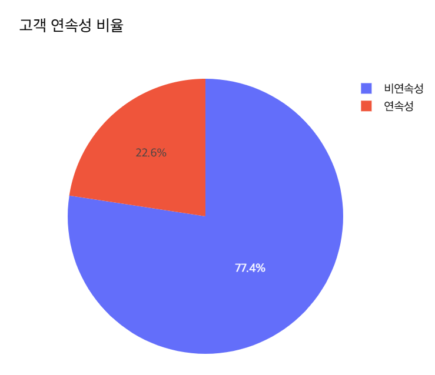
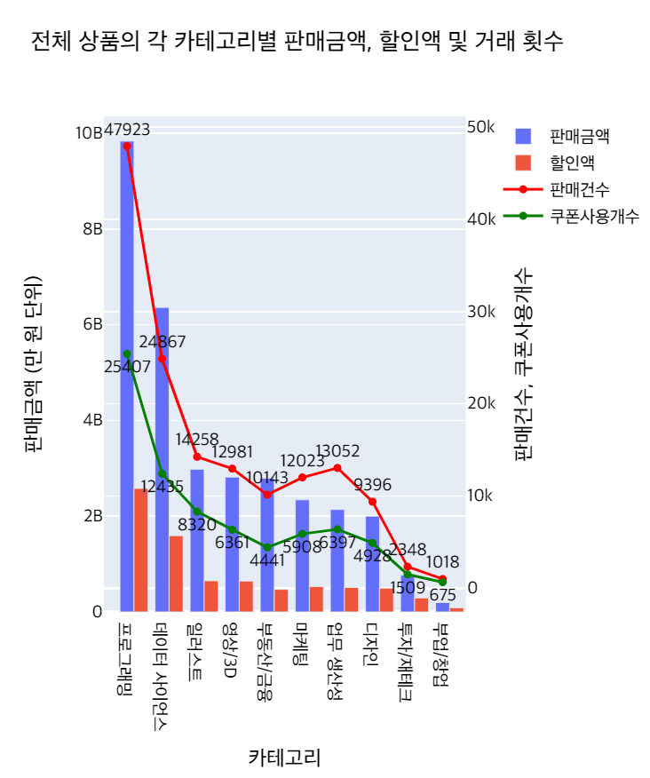
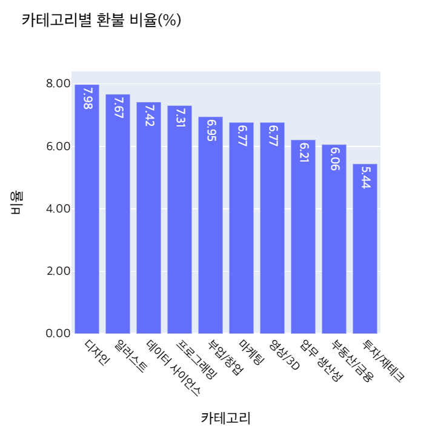

# 온라인 교육기업 결제 데이터 분석 (EDA Project)

**Team Members**: 김다현, 남선우, **변웅진**, 안효석, 이진우, 최준용

**My Role** : **팀장**으로 아이데이션 제시 및 분석계획 수립 팀원들의 인사이트를 모았으며, 최종 프리젠이션 발표 및 계설성 부분 시각화코드를 담당했습니다. 

## **프로젝트 개요**

- **프로젝트 목표**: 2022년 1년간 온라인기업의 강의 결제데이터를 분석, 인사이트 도출

- **데이터**: 결제 데이터 159,328개 (1인 중복결제, 프로모션 결제 포함)

- **기간**: 23.05.09 ~ 23.05.16

- **결과**:
> 

>
> - 참고: 김용담강사는 발표회 당일 부재로 발표채점 생략

 

### 프로젝트 기술스택

 
 
 
 
 
 

 

## 1. 탐색적 데이터분석(EDA) 수행계획

### **Overview**

데이원컴퍼니(패스트캠퍼스)의 과거 1년치의 데이터를 분석하여 비즈니스 매출 상승 혹은 손실 감소, 고객 서비스에 기여할 만한 인사이트 도출하기. 

- 데이터셋을 살펴본 결과, 분석 가능한 **주요 요인'Factor' 4가지**를 **가정**해 보았습니다.   

- 그 4가지 요인'Factor'를 가지고 교육기업의 **비즈니스 모델을 추론**하고자 했습니다.

- 추론한 비즈니스 모델을 가지고 **특징 및 강점과 약점을 파악**하여, **매출**에 어떻게 **영향**을 미치는지 살펴보았습니다.

- 결과적으로 분석결과에서 마케팅, 컨텐츠제작, 운영 등 **여러가지 관점으로 인사이트를 도출**해 보았습니다.

 

### **1st Step.**

현재 데이터 셋으로 어떤 **요인 ‘factor’** 을 분석할 수 있을까?

* **Factor**: **고객**
  * 실거래금액으로 매출, 결제 건, 쿠폰분석을 통해, 주 고객군을 분석한다.
  * B2C, B2B, 학생, 직장인, 기업, 신규 또는 기존 고객 인지 어느 고객이 주 고객이 되는가?
  * 주 고객군이 확인되면 마케팅에서 Audience 설정 전략을 수립 할 수 있지 않을까?

* **Factor**: **상품**, **카테고리**
  * 매출 및 결제건을 통한 주력 카테고리 및 상품을 확인한다.
  * 상품명 분석을 통해 패키지, 프리미엄, 단일코스 중 무엇이 매출에 주요 요소인가?.

* **Factor**: **계절성**
  * 1~12월동안 매출확인을 통해 매출에서 계절성을 띄는지 파악한다.
  * 요일별 결제건 추이로 요일성 또한 파악.
  * 계절성에 따른 마케팅 계획을 수립할 수 있는지 확인.

* **Factor**: **품질**
  * 상품별 카테고리별 환불율을 확인하여 품질를 파악.
  * ‘쿠폰이름’ 분석을 통해 쿠폰의 종류 및 할인, 유효한 결제건을 확인.
  * 퀄리티가 높은 상품 혹은 카테고리를 분류할 수 있지 않을까?

### **2nd Step.**
* 분석한 Factor를 이용해서 데이원컴퍼니의 **비즈니스 모델**을 추론해보자.
* 데이원컴퍼니는 **누구**에게 **무엇**을 **어느 때**에 서비스 하고 있고, 그 Quality 즉 **품질**을 파악할 수 있을까?

### **3rd Step.**
* **추론한** 데이원컴퍼니의 **비즈니스모델**에서 **특징들**은 **무엇**일까?
* 궁극적으로 **강점**은 어떻게 **더 보완**할 수 있을지? **약점**은 어떻게 **제거** 할 수 있을까?
* 그로인한 **매출 증대**는 가능한가?

 

## 2. 데이터 전처리 Data Preprocessing

 주어진 데이터 정보    

- 매출로 잡히지 않는 크리에이티브 카테고리 내용은 결측치로 판단, 삭제함.

- 결제시간 열을 세분화하여 월, 요일, 시간컬럼을 추가, 넘파이 데이트 타입으로 변경.

- 특정 컬럼들의 숫자 값이 string타입으로 되어있어 연산 가능한 int 타입으로 변경.

- 실거래건으로 보이지 않는 내부검수용은 결측지로 판단하여 제외.

- 판매건수 및 실거래금액, 판매액 계산 시, 실제 매출이 이루어지지 않는 환불거래 id들은 제외.

   전처리를 완료한 데이터 정보 

 

## 3. 분석 및 데이터 시각화

### **< 고객 Factor >**

#### 01. 구매 횟수별 고객 수 분포.

고객들의 구매 성향을 알아보자.  
전체 데이터에서 고객들은 일반적으로 몇 건을 결제하고 있는가?  
주 매출을 담당하고 있는 고객은 결제 수는 어떤가?

> ***분석내용***
>
> * 1~3회 결제한 고객이 주 고객층을 이루며, **신규유입**을 **필요**로 하는 **구조**로 파악.
> * 매출은 2회차에서 구매한 고객들에게 가장 많이 이루어졌다.
> * 2회차에서 3~4회차 구매고객을 보면, 구매한 고객수 대비 매출비중이 높다.
> * 최대 **5회차 구매까지 구매유도에 대한 전략**이 있다면 **매출에 도움**이 될 것으로 예상.

 

#### 02. 2회이상 결제고객 카테고리 연속성

1회차 구매이후 이탈하지 않고 지속적으로 강의를 들은 사람들의 카테고리 선택 성향을 알아보자.

> ***분석내용***
>
> * 22.6%가 연속적인 주제로 수강결제가 이루어지고 있으나, 그 외 비연속성을 보인다.
> * 77% 이상의 수강생들이 서로 다른 카테고리 안에서 강의를 수강했다.
> * **같은 카테고리를 수강 사람들은 23%** 그 외 다른 **77%는 다른 카테고리를 선택**하는 경향을 보였다.

 

#### 03. 고객의 결제수단

대체적으로 카드결제 및 간편결제로 이루어져 있는 상황

> ***분석내용***
>
> * **카드결제**가 압도적 비중이며, 포인트의 경우 페이종류의 **간편결제**로서 다음 비중을 차지.

 

### **<상품, 카테고리>**

#### 04. 카테고리별 매출, 비중 및 결제 횟수 추세

카테고리별 매출액을 비교, 주력 카테고리를 확인한다.

> ***분석내용***
>
> * **프로그래밍, 데이터사이언스 카테고리**가 약 **50%의 매출**을 담당하고 있음
> * 일러스트, 부동산/금융, 영상/3D, 마케팅, 업무생산성, 디자인 또한 비슷한 비율 매출규모로 유의미한 카테고리로 판단
> * 부업/창업 카테고리의 경우 매출비중이 1% 이하이다.
> * 부동산/금융, 영상/3D, 데이터사이언스 다른 카테고리에 비해 결제량 대비 매출이 크게 잡히고 있다.
> * 반대로 업무생산성, 마케팅, 프로그래밍은 결제량에 비해 매출이 적게 잡히고 있다.

 

#### 05. 카테고리별 쿠폰할인 비율 및 금액 비교

카테고리별 쿠폰할인을 반영하여 매출대비 쿠폰할인율 비교

> _**분석내용**_
>
> * 부동산/금융, 일러스트 카테고리는 적은 할인율에도 수강하는 경향을 보인다.
> * 부업/창업, 투자/재테크 카테고리는 유독 많은 할인율로 수강이 되고있음.
> * 할인되는 금액은 카테고리 별 매출액을 따라가는 것으로 보인다.

 

#### 06. 연간 카테고리별 매출비율 변화

연간 매출비율의 변동비율 그래프

> _**분석내용**_
>
> - 투자/재테크 비중은 1월 최대이었다가 점점 줄어들었다.   (주식시장 하락세로 주식관련 강의수요가 감소한것으로 판단)
> - 디자인, 업무생산성, 마케팅, 프로그래밍, 부동산/금융은 연간 일정한 매출 비중을 보여준다.
> - 일러스트의 경우 가장적은 비중이었다가 3위까지 높은 비중으로 늘어났다.
> - 영상/3D는 점점 비중이 조금씩 줄어들고 있다.

 

#### 07. 상품 키워드 빈도 분석

- 일러스트 카테고리 상품 키워드 분석
- 일러스트 카테고리 5월~11월 주요 상품키워드 변화

  

> _**분석내용**_
>
> - 연간 카테고리별 매출변화 중 두드러진 7~10월 변동사항을 알아보기위한 키워드분석
> - "네오아카데미" 키워드가 주요 키워드로 올라왔으며
> - 확인결과 홈페이지 메인카테고리로 분류된 외부 콜라보를 통해 기획된 상품.
> - 결과적으로 이 **기획된 상품**으로 **카테고리 매출에 크게 견인**한 것으로 판단되었다.

 

#### 08. The RED

‘**The RED**’와 ‘**올인원**’ 상품의 **매출액 비중**

> _**분석내용**_
>
> - 상품수 대비 매출액에 기여도, 결제 건 대비 매출액 기여도가 다소 높음
> - 컨텐츠 제작비용을 고려하여 추가 개설가능성 검토

 

#### 09. 카테고리별 환불 비율

카테고리별 환불율 계산:

- 결제 건 148,010건
- 환불 건 11,318건
- 전체 상품중 7.65% 환불되고 있음.

> _**분석내용**_
>
> - 카테고리별 환불율의 차이가 있음을 확인했다.

 

### **<계절성>**

#### 10. 1년간 매출&결제수 추세

1년간 매출액(실거래금액)&판매건 추세비교

> _**분석내용**_
>
> - 12~1월 최대매출 및 최다판매가 이루어지며 3,4,5월에 매출이 급감하는 현상이 있다

 

#### 11. 카테고리별 연간 매출 추세

카테고리별 매출 추세

> _**분석내용**_
>
> - 프로그래밍의 경우 4,5월 판매저조 현상 10,11월 판매 저조현상 두드러지게 나타남
> - 반면 계절성에 둔감한 카테고리도 다수 존재.
> - 일러스트의 8,9월 매츨 증가현상은 위에 검토한 ‘네오아카테미 기획 상품’으로 판명

 

#### 12. 카테고리별 연간 환불 추세

- 💡 카테고리별 연간 환불비율
  계산결제 건: 148,010건
  환불 건: 11,318건
  전체상품 중 7.65% 환불되고 있음.

> _**분석내용**_
>
> - 부업/창업 카테고리 중 4월이 특히 이상 환불 급등현상.
> - 투자/재테크 6월, 9월 환불률이 급락하는 이상치 보인다.

 

#### 13. 요일,시간대별 평균 결제 및 환불 건

- 평균 요일별 **판매** **시간대**

- 평균 요일별 **환불** **시간대**

> _**분석내용**_
>
> - 평균적으로 월요일 오전 10시 그리고 일요일 오후 11시 시간대에 특히 많은 결제 건이 발생.
> - 환불은 주로 오전 낮시간대 집중된 현상을 보인다.

 

## 4. 비즈니스 모델 추론 및 결론

분석을 종합한 결과,

**고객 Factor**

- 주 고객은 1회에서 3회 결제한 대체적으로 **신규유입으로 판단되는 고객**들 에게서 **주 매출**이 이루어졌습니다.

- 2회차 결제를 한 고객들이 가장 많은 매출을 견인한 것으로 확인됩니다. 

- 교육강의 특성상 기존고객들의 수요 보단 항시 **새로운 유입을 필요로 하는 고객구조**를 보이고 있습니다.

- 1회 구매 이후 지속적으로 다른 강의를 들은 고객들의 카테고리 선택 성향을 알아보니 같은 **카테고리를 들은 사람들은 23%**, 반대로 **다른 카테고리 선택한 사람들은 77%**로 고객군이 형성됨을 보입니다.

- 고객들의 **결제수단은 카드결제가 압도적** 이였고, 다음으로 간편결제, 프로모션 이용 또한 보였습니다.

 

**카테고리 Factor**

- 주로 IT 카테고리인 프로그래밍과 데이터사이언스가 매출 비중이 50% 가까이 되지만, 일러스트, 부동산/금융, 영상/3D, 마케팅, 업무 생산성, 디자인 또한 10~6% 사이 비등한 비율의 매출규모로 **주요 카테고리**와 **유의미한 카테고리**가 있습니다. 

- 또한 **카데고리별 매출에 대한 기여도가 달랐다.** 이는 컨텐츠를 기획하는데 고려사항이라고 봅니다.

- 대표적으로 **일러스트의 경우** 1월 매출 비중이 가장적은 카테고리 었지만 외부 기관과 협업기획을 하여 22년 후반 매출비중이 3위에 까지 상승하여 **기획컨텐츠의 매출기여가 우수했다고 판단**합니다.

- 하지만 부업/창업, 투자/재테크는 타 카테고리에 비교해 많은 쿠폰할인에도 판매가 부진하며 22년 초반 매출비중이 있던 투자/재테크는 외부요인에의해 급격한 수요저하 등 재고할 필요가 있어보입니다. 투자/재테크의 경우 22년 주가 하락과 더불어 수요가 급감한 것으로 판단됩니다.

 

**계절성 Factor**

- 데이터의 계절성도 파악해보니 12월 1월 가장많은 판매고를 올렸습니다. 

- **카테고리에 따라 계절성에 민감하게 반응**하기도 하여 마케팅시 고려사항으로 판단되었습니다. 

- 3월부터 5월에 최대 판매저조 현상이 있고 프로그래밍 카테고리에서 두드러지게 나타납니다.

- 주간 판매량 및 판매시간대도 살펴본 결과 **특별히 결제가 이루어지는 시간대**가 있어 **마케팅시 주요 고려사항**으로 판단됩니다.

 

## 5. 한계

- 데이터를 살펴보면서 세운 몇몇 가설들은 실제 데이터를 다듬고 시각화했을때 예상과 반대 경우들이 있었고, 전혀 예측 못했던 사실을 알게된 경우도 있었습니다.

- 더 레드 강의포멧 경우 당연히 평균판매가가 높을거라고 예상했지만 실제 분석결과 눈에 띄게 차이가 나지 않았습니다.

- 고객의 같은 카테고리내 구매 연속성을 파악할때 특정 카테고리에서 더 연속성을 가지는지 심화해 볼수 있었지만, 수행하지 못한 아쉬움이 있다.

- 네오아카데미 같은 특정 기획 컨텐츠가 매출에 기여한 사실을 확인했듯, 다른 카테고리에서도 유사한 분석을 시도했지만 결과를 내지는 못했습니다.
